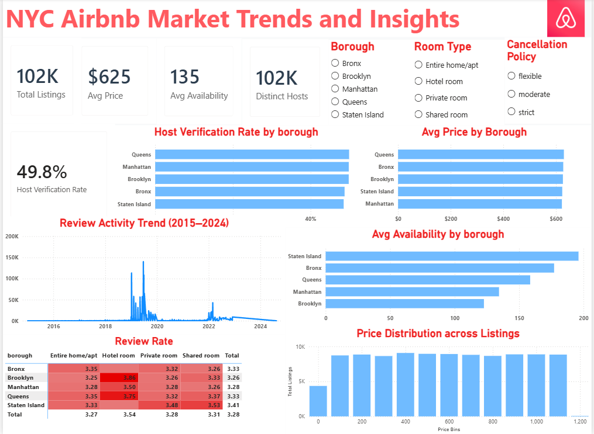
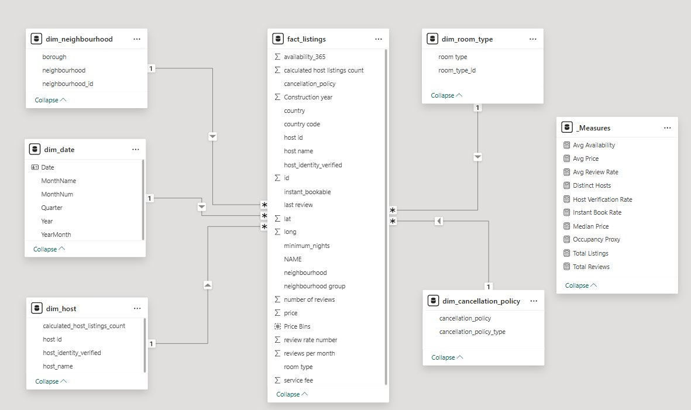

# NYC Airbnb Market Trends and Insights

An end-to-end data analytics project that turns a raw 102,000-row Airbnb data into a clean star-schema data model and a single-page interactive Power BI dashboard. The project covers the full analytics lifecycle: data cleaning, dimensional modeling, data validation, DAX measure authoring, and visual storytelling.

> **Live dashboard:** [View live Power BI dashboard](https://app.powerbi.com/view?r=eyJrIjoiOWYxMDYxNmQtMTEzYy00MjY5LTgzOGMtMDlhMTkyOWM4NDAxIiwidCI6Ijk2NDY0YThhLWY4ZWQtNDBiMS05OWUyLTVmNmI1MGEyMDI1MCIsImMiOjN9)

> 
---

## What this project demonstrates

This was built to showcase a practical, end-to-end business analyst and data analyst skillset:

- **Data cleaning and validation** on a messy real-world dataset (duplicates, typos, out-of-range values, type errors)
- **Dimensional data modeling** using a classic Kimball star schema
- **DAX measure authoring** centralized in a dedicated measures table
- **Relationship and cardinality design** following modeling best practice
- **Insight communication** through a focused dashboard and a stakeholder-ready presentation

---

## The dataset

A publicly available snapshot of New York City Airbnb listings.

| Attribute | Value |
|---|---|
| Raw records | 102,598 rows |
| Raw attributes | 26 columns |
| Cleaned records | approximately 101,781 rows |
| Cleaned attributes | 25 columns |
| Coverage | All five NYC boroughs and several hundred neighbourhoods |

The data covers geography (borough, neighbourhood, coordinates), pricing (nightly price, service fee), host information (identity, verification, listings count), booking conditions (cancellation policy, instant book, minimum nights, availability), and review activity (review count, last review date, review rating).

---

## Project workflow

```
Raw Excel export
      |
      v
1. Data cleaning and validation 
      |
      v
2. Star schema design             
      |
      v
3. DAX measure authoring          
      |
      v
4. Dashboard construction        
      |
      v
5. Insight communication          
```

---

## The data model

The cleaned flat table was decomposed into a classic star schema: one central fact table surrounded by five dimension tables. This separates the numbers you measure (price, fees, availability, reviews) from the context you slice them by (host, geography, room type, cancellation policy, time).



**Tables in the model:**

| Table | Role | Key columns |
|---|---|---|
| `fact_listings` | Central fact table | listing id, all foreign keys, price, service fee, availability, reviews |
| `dim_host` | Host details | host id, host name, verification status, listings count |
| `dim_neighbourhood` | Geography | neighbourhood, borough, neighbourhood id |
| `dim_room_type` | Room lookup | room type, room type id |
| `dim_cancellation_policy` | Policy lookup | cancellation policy, policy type |
| `dim_date` | Calendar | date, year, quarter, month, year-month |

All five relationships are **many-to-one with single-direction filtering**, consistent with star-schema best practice. Bidirectional filtering was deliberately avoided because it can introduce ambiguity in the filter context and produce silently incorrect aggregations.

See [docs/data_model.md](docs/data_model.md) for the full relationship table and design notes.

---

## Key findings

Four analytical themes, each answering one business question.

### 1. Pricing

Average nightly prices are remarkably flat across all five boroughs (clustering in the 620 to 640 dollar range). The mean is pulled up by long-tail luxury listings present in every borough, so **room type matters more than borough** for pricing within a given tier. The median price tells a more typical Manhattan-led story, which is why both measures exist in the model.

### 2. Host verification

Only **49.8 percent** of listings are operated by identity-verified hosts, almost exactly a coin flip. This split is consistent across all five boroughs, meaning verification is a platform-wide behaviour rather than a geographic trust signal. Completing verification is therefore a low-cost competitive lever for any individual host.

### 3. Reviews and recency

Review activity follows a clear three-act story: a build-up from 2015 to 2018, a peak in 2018 to 2019, and a sharp collapse in 2020 that lines up with the COVID-19 pandemic and travel restrictions. A modest recovery begins in 2022 but does not return to pre-pandemic levels within the dataset window. Separately, **hotel rooms rate consistently higher** than other room types across every borough.

### 4. Availability

Outer boroughs show higher average availability (Staten Island around 180 days per year) while Manhattan and Brooklyn sit lowest (around 120 days). Read as a demand proxy, lower availability implies heavier booking, which matches the expectation for centrally located, high-demand rentals.

---

## DAX measures

Nine measures were authored in a dedicated `_Measures` table to centralize the analytical logic and keep the fact table clean.

| Measure | Purpose |
|---|---|
| Total Listings | Top-line market-size KPI |
| Avg Price | Headline pricing metric |
| Median Price | Outlier-resistant pricing alternative |
| Avg Availability | Host commitment and demand proxy |
| Total Reviews | Engagement and activity indicator |
| Distinct Hosts | Supply-side diversity |
| Host Verification Rate | Trust and platform integrity |
| Instant Book Rate | Frictionless-booking adoption |
| Avg Review Rate | Quality and satisfaction signal |

Full definitions are in [docs/dax_measures.md](docs/dax_measures.md).

---


---

## How to explore this project

1. **Fastest:** open the [live dashboard link](https://app.powerbi.com/view?r=eyJrIjoiOWYxMDYxNmQtMTEzYy00MjY5LTgzOGMtMDlhMTkyOWM4NDAxIiwidCI6Ijk2NDY0YThhLWY4ZWQtNDBiMS05OWUyLTVmNmI1MGEyMDI1MCIsImMiOjN9) above (no install needed).
2. **For the full story:** open the [presentation deck](https://1drv.ms/p/c/8646e285e30fbcef/IQBqpCyVp1w3RbsLOvOPIDEiAQL3vnuQ9-YYg1_TG-43tH8?e=OhYrxt).
3. **To inspect the model and DAX yourself:** download `powerbi/Airbnb_data_modelled.pbix` and open it in [Power BI Desktop](https://powerbi.microsoft.com/desktop/) (free).

---

## Tools used

Microsoft Power BI Desktop, Power Query (M language), and DAX. Dimensional modeling follows the principles in Kimball and Ross, *The Data Warehouse Toolkit*.

## Note on the data

This project uses a publicly available dataset of NYC Airbnb listings. It contains no confidential, client, or proprietary information and is intended purely as a portfolio demonstration of data analysis and modeling skills.
